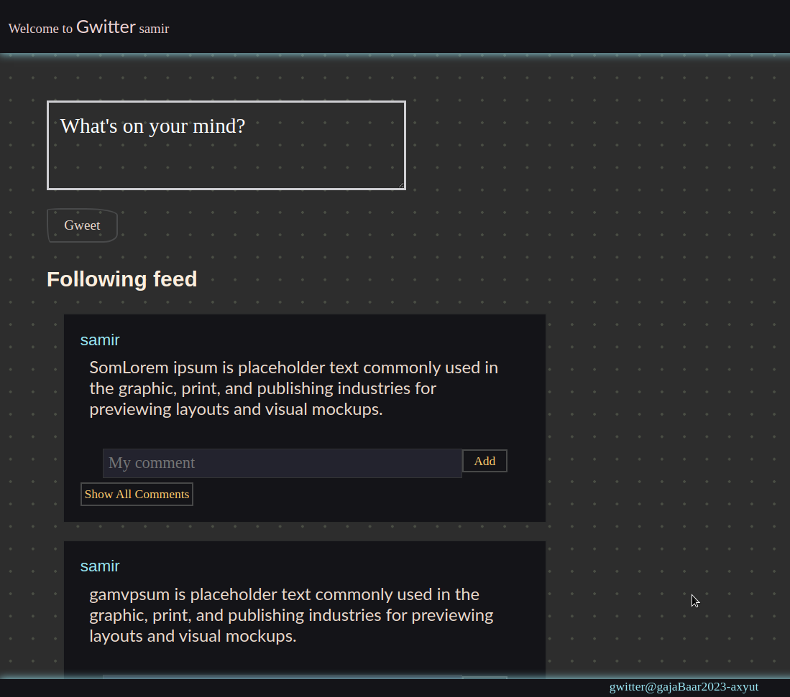
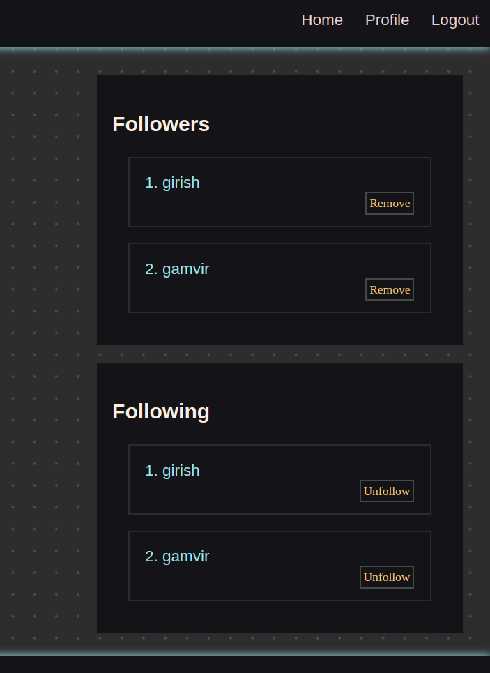
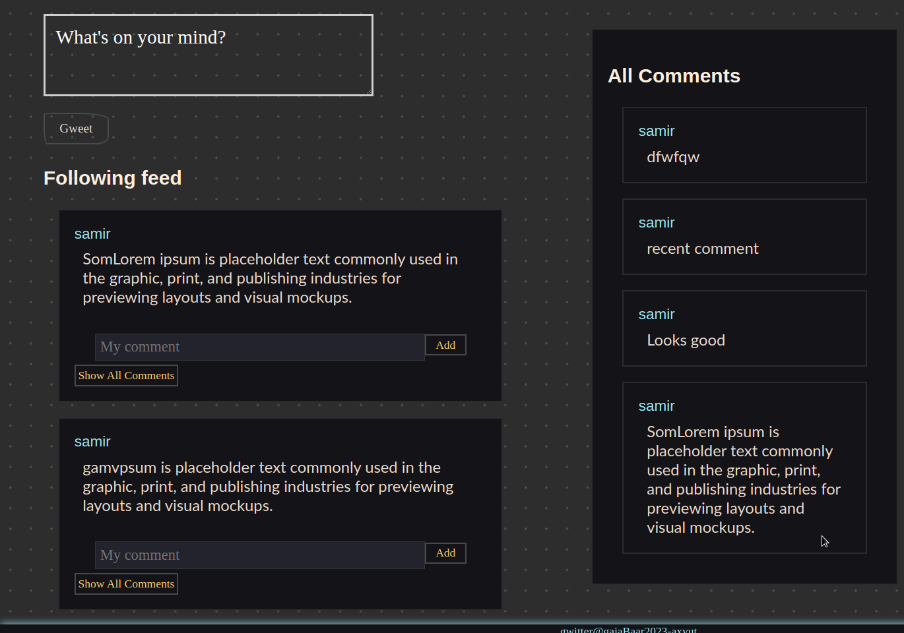

<h1 align="center"><a href="https://github.com/axyut/2023-summer/">Gwitter</a></h1>

   

    An application with similar in features of twitter,
but we will call it gwitter. Users will be able to sign up, sign in and sign out.
Once signed in, they will be able to follow other users.
On their home page, they will be able to see the feed
of tweets from people that they follow.
Your users should also be able to see their own profile
and tweets.

## Table of Contents

- [Table of Contents](#table-of-contents)
- [Built With](#built-with)
- [Getting Started](#getting-started)
  - [Prerequisites](#prerequisites)
  - [Installation](#installation)
- [App](#app)
  - [SQLite Database](#sqlite-database)
  - [PHP backend](#php-backend)
  - [Frontend](#gwitter-frontend-html-css-js)
  - [Security](#security-and-tests)
- [Application Structure](#application-structure)

- [Working](#working)

<!-- ABOUT THE PROJECT -->

### Built With

This project is build with following languages and framework

- [Html](https://html.com)
- [Css](https://developer.mozilla.org/en-US/docs/Web/CSS)
- [Javascript](https://www.javascript.com/)
- [PHP](https://www.php.net/)
- [Docker](https://www.docker.com/)

### Prerequisites

- Text editor
- sqlite3
- PHP
- Docker

### Installation

Follow the following commands to set up in your local machine.

`cd /1.Gwitter/axyut/`
 
`bash build-docker.sh`
 
Go to docker container ip at port 80

## App

### SQLite Database

SQLite is used primarily because
it's light-weight and easy to get up and running.

All the application data such as registered users, generated gweets, further comment gweets, your followers and whom you're following are implemented with sqlite3 database.

### PHP backend

With PHP, user sign up, sign in, sign out, post gweets, follow eachother, connected to sqlite database.

### Gwitter Frontend (Html, Css, Js)

A CSS framework to make it look prettier, added new features that hihglight the user experience and interface, and some bug fixes.

A Dockerfile is also setup that will install and run your application.

### Security and Tests

A security scan of the application using openvas is to be done and then pick a vulnerability that openvas reports (or doesn't report but you know from reading their source code that it's a vulnerability)
then do a deep dive on how you can exploit that vulnerability.

## Application Structure

Final organization of files is as follows

- /1.gwitter/axyut
  - /database
    - README.md (details about database design and how to run the sql files)
    - schema.sql
    - populate.sql
    - query.sql
    - userQuery.sql
  - /reports
    - README.md [has sections for week1, week2, ...]
  - home.php
  - profile.php
  - Dockerfile
  - build_docker.sh
  - README.md (describe the general application, installation, usage)

## Working

Preview of how the website is supposed to function.

- ### Gwitter Front page
  - #### Login, Register
    You can Login, register and read about Gwitter's policy, its wokrking mechanism and its views.
    
  - #### About
    
- ### Home Page
  All the gweets from the people you follow will appear here also you can post gweets and comment on other's gweets here. At side, People you may know will appear and you can follow them pressing the follow button.
  - #### Post Gweets, and Comment on other's Gweets
    
  - #### Contacts You would like to follow
    
- ### Profile Page
  This is your profile page where all the gweets you ever posted will appear. You can see the Peoples you follow and also your followers directly at the side.
  - #### My Gweets
    
  - #### My Following and Followers
    
- #### Comments
  You can comment on your gweets as well as other peoples gweets and the comments will appear like this on the side for any `See All Comments` button you select for.
  
